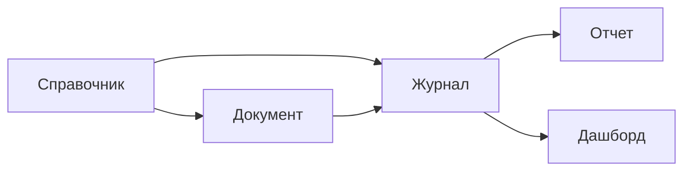

## Введение

Кодогенерация представляет собой мощный инструмент, который позволяет существенно упростить, ускорить и шаблонизировать процесс разработки проектов и их модулей, особенно тех, которые содержат большое количество билдплейт-кода. Билдплейт-коды — это повторяющиеся шаблоны кода, которые часто используются в различных проектах, и их автоматизация может значительно сократить время разработки и минимизировать риск ошибок.

Используя кодогенерацию, разработчики могут:

1. **Автоматизировать повторяющиеся задачи**: Кодогенерация позволяет автоматически генерировать код для стандартных компонентов, таких как формы ввода данных, базовые страницы или шаблоны API, что уменьшает ручной труд и снижает вероятность ошибок.
    
2. **Ускорить разработку**: Благодаря тому, что значительная часть кода генерируется автоматически, разработчики могут сосредоточиться на более сложных и творческих аспектах проекта, что в целом ускоряет процесс разработки.
    
3. **Улучшить качество кода**: Кодогенерация может обеспечить последовательность и стандартизацию кода, что облегчает его поддержку и модификацию в будущем.
    
4. **Снизить затраты**: Уменьшая время, необходимое для разработки, кодогенерация может привести к снижению затрат на проекты и улучшению экономической эффективности.

Таким образом, кодогенерация становится важнейшим инструментом в современной разработке программного обеспечения, позволяя оптимизировать процесс создания проектов и сосредоточиться на инновациях и добавленной стоимости.

## Основные элементы системы

Прежде чем приступать к имплементации кодогенерации, необходимо выделить основные элементы, на которых будет строиться наша система. Наша система ведет учет производственных показателей системы, и состоит из трех частей: документ, журнал и отчеты:



### Доменная уровень приложения

На доменном уровне определяем набор необходимых обобщенных абстракций элементов. К ним относятся: пользователь, код документа, генератор нового кода документа, документ, репозиторий документа и параметры черновика, регистратор документа, список введенных документов в систему (история).

#### Пользователь

Пользователь является отображением реального пользователя, который производит взаимодействие с документами и другими компонентами системы.

```java
/**
 * Интерфейс для пользователя.
 */
public interface User {

    /**
     * Возвращает имя учётной записи пользователя.
     */
	String account();

    /**
     * Возвращает имя пользователя.
     */
	String name();
}
```

#### Код документа

Код документа является уникальным идентификатором, который используется для распознавания и обработки документов в системе.

```java
/**
 * Интерфейс для кода документа.
 */
public interface DocumentCode {

    /**
     * Возвращает значение кода документа.
     */
	String getValue();
}
```

#### Генератор нового кода

Генератор нового кода документа является, выполняет создание уникальных идентификаторов для новых документов. Обеспечивает автоматизацию процесса присвоения кодов и предотвращает дублирование идентификаторов.

```java
/**
 * Интерфейс для генератора кодов документов.
 */
public interface DocumentCodeGenerator {

    /**
     * Возвращает следующий код документа.
     */
    DocumentCode nextCode();
}
```

#### Документ

Документ является основной единицей информации в нашей системе, содержащей данные о производственных показателях преприятия. Он включает в себя уникальный идентификатор, информацию о создании и обновлении, а также данные о пользователях, которые его создали и обновили.

```java
/**
 * Интерфейс для документа.
 */
public interface Document {

    /**
     * Возвращает код документа.
     */
    DocumentCode getCode();

    /**
     * Возвращает дату создания документа.
     */
    LocalDate getCreated();

    /**
     * Возвращает пользователя, создавшего документ.
     */
    User getCreatedBy();

    /**
     * Возвращает дату последнего обновления документа.
     */
    LocalDate getUpdated();

    /**
     * Возвращает пользователя, обновившего документ последним.
     */
    User getUpdatedBy();

}
```

#### Репозиторий документа

Репозиторий документа является инструментом доступа к хранилищу, которое содержит все документы и обеспечивает доступ к ним. Он предоставляет методы для создания черновиков, сохранения, поиска и удаления документов, что позволяет эффективно управлять документами на протяжении всего их жизненного цикла.

```java
/**
 * Интерфейс репозитория документов.
 */
public interface DocumentRepository {

    /**
     * Создаёт черновик документа на основе заданных параметров.
     *
     * @param parameters Параметры для создания черновика.
     */
    Document createDraft(DocumentDraftParameters parameters);

    /**
     * Сохраняет документ в репозитории.
     *
     * @param document Документ для сохранения.
     */
    void save(Document document);

    /**
     * Возвращает документ по его коду.
     *
     * @param documentCode Код документа.
     */
    Document getByCode(DocumentCode documentCode);

    /**
     * Удаляет документ из репозитория.
     *
     * @param document Документ для удаления.
     */
    void delete(Document document);
}
```

#### Параметры черновика

Параметры черновика документа представляют собой набор данных, которые используются для создания нового документа в состоянии черновика. Эти параметры могут включать в себя название документа, его содержание, метаданные или другие важные атрибуты, которые определяют характеристики документа.

```java
/**
 * Интерфейс для параметров черновика документа.
 */
public interface DocumentDraftParameters {
    // параметры добавляются в потомки, при необходимости
}
```

#### Регистратор документа

Регистратор документа является компонентом системы, который отвечает за регистрацию и дерегистрацию документов. Он обеспечивает наполнение данными журнал при регистрации и очистку журнала от данных документа при снятии его с регистрации.

```java
/**
 * Интерфейс регистратора документа.
 */
public interface DocumentRegister {

    /**
     * Регистрирует документ в системе.
     * @param document Документ для регистрации.
     */
     void registration(Document document);

	/**
     * Дерегистрирует документ из системы.
     * @param document Документ для дерегистрации.
     */
     void deregistration(Document document);
}
```

#### История введенного документа

История введенного документа представляет собой запись, которая содержит информацию о жизненном цикле документа, включая его создание, обновления и регистрацию. Эта информация позволяет отслеживать все изменения и действия, связанные с документом.

```java
/**
 * Интерфейс истории введенного документа.
 */
public interface DocumentHistory {
	String getCode();
	LocalDate getCreated();
	String getCreatedBy();
	LocalDate getUpdated();
	String getUpdatedBy();
	String getStatus();
	String getRegistratorBy();
	LocalDate getRegisterDate();
}
```

#### Репозиторий истории ввода документов

Репозиторий истории ввода документов является хранилищем, которое содержит все записи истории документов. Он предоставляет методы для поиска и извлечения истории документов на основе различных критериев.

```java
public interface DocumentHistoryRepository {
	Page<DocumentHistory> findAll(specification, pageable);
	List<DocumentHistory> findAll(specification, sort)
}
```

### Уровень приложения

На уровне приложения необходимы абстракции, которые позволяют выполнить преобразование объектов команды в сущности и value object доменной системы, а также выполнить вызов доменных use case. К этим абстракциям относятся: команды (Command), обработчики команд (CommandHandler), запросы Query, фабрика создания колонок, фильтр спецификации, фабрика создания спецификации для фильтрации данных, маппер данных фабрика создания Pageable и фабрика создания Sortable. 

#### Команды (Command)

Команды содержат данные и информацию о действиях, которые необходимо выполнить в системе. Они могут быть использованы для создания, обновления или удаления сущностей.


```java
/**
 * Базовая реализация команды.
 */
public interface Command {
    // методы доступа
}
```

#### Обработчики команд (CommandHandler)

Обработчики команд отвечают за обработку команд и выполнение соответствующих действий. Они часто взаимодействуют с доменными сущностями и сервисами для обеспечения запуск бизнес-логики.

```java
/**
 * Интерфейс для обработчика команд.
 */
public interface CommandHandler {

	/**
     * Обрабатывает заданную команду.
     *
     * @param command Команда для обработки.
     */
     void handle(Command command);

}

```

#### Запросы Query

Запросы на получение данных из системы. Они могут быть использованы для выборки определенных сущностей или наборов данных на основе заданных условий. Могут возвращают простые структуры и структуры с метописанием.

```java
/**
 * Базовая реализация запроса с фильтрацией.
 */
public interface class GetTablePageQuery<T, Filter extends SpecificationFilter> {

  /**
   * @param pageable данные страницы.
   * @param filter   фильтр данных.
   * @return Страница таблицы.
   */
  TablePage<T> execute(TablePageable pageable, Filter filter);
}

/**
 * Базовая реализация запроса с фильтрацией.
 *
 * @param <T>      Тип данных постраничной таблицы.
 * @param <Filter> Тип фильтра.
 */
public interface class GetTableQuery<T, Filter extends SpecificationFilter> {

  /**
   * @param sortable данные для сортировки.
   * @param filter   фильтр данных.
   * @return Страница таблицы.
   */
  Table<T> execute(TableSortable sortable, Filter filter);
}
```

#### Фильтр спецификации

Содержит данные на основе определенных будет выполняться фильтрация в запросах. Он может быть использован для ограничения набора данных, который необходимо отобразить или обработать.


```java
/**
 * Интерфейс для реализации фильтрации.
 */
public interface SpecificationFilter {
	// параметры добавляются в потомки, при необходимости
}
```

#### Фабрика создания спецификации

Компонент создает спецификацию на основании данных фильтра спецификации. Он может быть использован для создания динамических фильтров на основе пользовательских требований.


```java
/**
 * Фабрика для создания спецификации (условий фильтрации данных).
 *
 * @param <T> тип сущности данных.
 */
public interface SpecificationFactory<T> {

  /**
   * @param filter фильтр данных.
   * @return Спецификации (условия фильтрации данных).
   */
  Specification<T> create(SpecificationFilter filter);
}
```

#### Фабрика создания колонок

Создает и выполняет настройку колонок для отображения данных. Он может быть использован для динамической настройки интерфейса пользователя.


```java
/**
 * Интерфейс для реализации фабрики создания колонок.
 */
public interface ColumnFactory {

  /**
   * Создать колонки.
   *
   * @return Список колонок.
   */
  List<Column> create();
}
```

#### Маппер данных

Выполняет преобразование между доменными сущностями и данными, полученными из внешних источников.


```java
/**
 * Интерфейс для маппера, преобразующего объекты из одного типа в другой.
 */
public interface Mapper<Source, Destination> {  

    /**
     * Преобразует объект исходного типа в объект целевого типа.
     *
     * @param source Объект для преобразования.
     */
     Destination map(Source history);  
    
}
```

#### Фабрика создания Pageable

Создает доменный Pageable из библиотеки spring на основании абстракции TablePageable.

```java

/**
 * Фабрика для создания объекта Pageable из url.
 */
public interface PageableFactory {

  /**
   * Создать параметры страницы с сортировкой.
   * @param pageable параметры страницы с сортировкой.
   */
  Pageable create(TablePageable pageable);
}
```

#### Фабрика создания Sortable

Создает доменный Sort из библиотеки spring на основании абстракции TableSortable.

```java

/**
 * Фабрика для создания объекта Sort из url.
 */
public interface SortableFactory {

  /**
   * Создать параметры сортировки.
   * @param sortable параметры сортировки.
   */
  Sort create(TableSortable sortable);

}
```

## Выбор инструмента генерации

Основным языком разработки в нашей команде является Java 21 и сборщиком Maven. Поэтому это является основной причиной выбора создания плагина для Maven, также есть дополнительные факторы влияющие на выбор:

- **Автоматизация**: Maven-плагин может автоматически генерировать код на этапе сборки, что упрощает процесс разработки и исключает ручные ошибки. Это особенно важно для проектов, где требуется быстрая генерация кода на основе определенных правил или схем.
    
- **Интеграция с CI/CD**: Плагин может быть легко интегрирован в пайплайны непрерывной интеграции и доставки (CI/CD), что позволяет автоматизировать процесс генерации кода на разных этапах разработки. Это обеспечивает последовательность и надежность в процессе разработки и развертывания.
    
- **Повторное использование**: Плагин может быть использован в нескольких проектах, что снижает время на разработку и поддержку кодогенерации. Это особенно полезно для команд, которые работают над несколькими проектами с похожими требованиями к генерации кода.

## Генерация

###  Проект генерации и структура

Для генерации был создан проект, который отвечает за генерацию исходного кода по описанию его структура включает в себя несколько модулей, каждый из которых отвечает за определенный свою функциональную область. Ниже приведено описание каждого модуля и его составляющих:

```
.
└── project-generator/
    └── modules/
        ├── source-generator/
        │   └── src.main/
        │       ├── java.com.projectgeneratortools.codegen/
        │       │   └── ...
        │       └── resources.templates/
        │           └── java/
        │               └── *.mustache
        ├── source-generator-cli/
        │   └── src/
        │       ├── java/
        │       │   └── ...
        │       └── main/
        │           └── ...
        ├── source-generator-core/
        │   └── src/
        │       ├── java/
        │       │   └── ...
        │       └── main/
        │           └── ...
        └── source-generator-maven-plugin/
            └── src/
                ├── java/
                │   └── ...
                └── main/
                    └── ...
```

- **source-generator**: Этот модуль содержит основную логику генерации кода. В нем находятся классы, отвечающие за генерацию кода (`java.com.projectgeneratortools.codegen`), и шаблоны для генерации кода на основе Mustache (`resources.templates/java/*.mustache`).
    
- **source-generator-cli**: Модуль для командной строки. Он включает в себя классы, которые позволяют запускать генератор кода из командной строки, и содержит входную точку приложения.
    
- **source-generator-core**: Ядро генератора кода. Этот модуль содержит основные классы, которые обеспечивают функциональность генерации кода.
    
- **source-generator-maven-plugin**: Плагин для Maven, который интегрирует генератор кода в процесс сборки проекта. Он позволяет автоматически генерировать код во время выполнения Maven-команд.

## Подключение модуля в бизнес проект

Чтобы использовать **source-generator-maven-plugin** в проекте Maven, выполняются следующие шаги:

1. **Добавляется плагин в файл `pom.xml`**:
   
   Включается плагин в секцию `<build>` файла `pom.xml`: 
   
   ```xml
<project>
    <build>
        <plugins>
            <plugin>
	            <groupId>com.generator</groupId>
                <artifactId>source-generator-maven-plugin</artifactId>
                <version>1.0.0</version>
                <executions>
	                <execution>
                        <goals>
                            <goal>generate</goal>
                        </goals>
			            <input>
				            ${project.basedir}/src/main/resources/entities.json
		                </input>
                    </execution>
                </executions>
            </plugin>
        </plugins>
    </build>
</project>
```
   
2. **Добавляется файл с описание сущностей в проекте entities.json**.

3. **Запуск генерации кода**:
   
   Для запуска генерации кода выполняется команда:

   ```bash
   mvn source-generator-maven-plugin:generate
   или
   mvn compile
   ```

## Планы на будущие

Планы на будущее состоят из двух основных веток: расширение функционала и добавление грамматики ANTLR4.

### Расширение функционала

Планы по расширению возможностей генерации кода для других частей системы включают в себя несколько ключевых направлений:

#### Расширение для фронтенда

- **Ресурсы API и структуры DTO**: Генерация кода для API и DTO может существенно упростить процесс создания интерфейсов между фронтендом и бэкендом. Это позволит автоматически создавать необходимые модели данных и API-клиенты на основе определенных правил или схем. Таким образом, разработчики смогут быстро интегрировать фронтенд и бэкенд компоненты, уменьшая время на разработку и снижая риск ошибок.

- **Базовые формы ввода и отображения данных**: Автоматическая генерация базовых форм и компонентов для отображения данных может ускорить процесс разработки фронтенда. Эти формы могут быть затем изменены разработчиками для лучшего соответствия дизайну и функциональным требованиям. Это позволит разработчикам сосредоточиться на кастомизации и улучшении пользовательского опыта, а не тратить время на создание базовых компонентов.

#### Расширение для миграций данных

- **Реализация миграций данных**: Генерация кода для миграций данных может помочь в управлении изменениями в базе данных, особенно при обновлении схемы или переносе данных между разными системами. Это может включать в себя создание скриптов для обновления таблиц, добавления новых полей или изменений типов данных. Автоматизация миграций позволит уменьшить риск ошибок и повысить безопасность данных.

### Грамматика ANTLR4

В перспективе планируется переход от использования мета-описаний к интеграции библиотеки **ANTLR4**. Этот переход позволит повысить эффективность и гибкость в обработке и генерации кода, а также добавить следующие функции:

- **Подсветка синтаксиса**: ANTLR4 позволит реализовать подсветку синтаксиса для создаваемого кода, что улучшит читаемость и понимание кода разработчиками. Это сделает процесс разработки более комфортным и поможет в выявлении ошибок на ранних стадиях.

- **Показ ошибок в модели**: С помощью ANTLR4 можно будет отображать ошибки в модели во время редактирования, что поможет разработчикам быстро выявлять и исправлять проблемы. Это существенно уменьшит время на отладку и позволит сосредоточиться на логике приложения.

- **Автозаполнение**: Интеграция ANTLR4 также позволит реализовать функцию автозаполнения, которая упростит процесс написания кода и уменьшит количество ошибок, связанных с опечатками или забытыми конструкциями. Это сделает процесс разработки более эффективным и комфортным для разработчиков.
